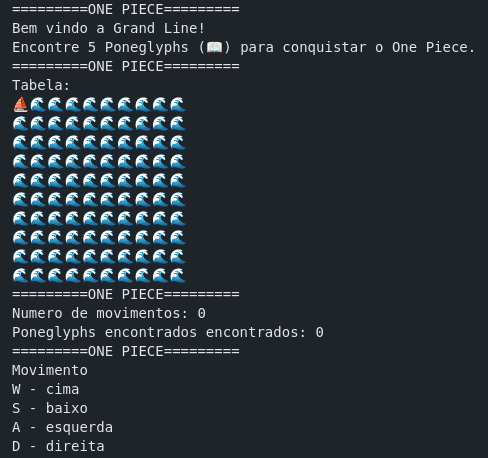

# One Piece - Caça ao Tesouro na Grand Line

Bem-vindo, pirata! Este é um jogo de aventura em texto onde seu objetivo é navegar pela perigosa Grand Line em busca do tesouro supremo, o One Piece. Para isso, você deve encontrar 5 Poneglyphs antigos (📖) espalhados pelo mar.

## Demonstração

## Objetivo

Encontrar **5 Poneglyphs (📖)** antes de esgotar seus movimentos. Você tem um limite de **20 movimentos** para completar sua missão.

## Como Jogar

Você é o capitão do seu navio (⛵) e navega por um tabuleiro 10x10. O mapa começa oculto (🌊) e é revelado à medida que você explora.

Use as seguintes teclas para se mover:
- **W**: Mover para Cima
- **S**: Mover para Baixo
- **A**: Mover para a Esquerda
- **D**: Mover para a Direita

**Atenção:** Tentar mover-se para uma área já visitada resultará em uma jogada perdida, consumindo um movimento.

## Elementos do Jogo

- **⛵ (Seu Navio):** Representa sua posição atual no mapa.
- **🌊 (Mar Aberto):** Uma área inexplorada do mapa ou uma área já visitada que não continha um Poneglyph. Interagir com o mar tem o mesmo efeito que encontrar a Marinha.
- **📖 (Poneglyph):** O objetivo! Encontrar um destes te aproxima da vitória.
- **⚓ (Marinha):** Cuidado! Ao encontrar a Marinha.
- **💥 (Combate):** Símbolo que aparece quando você interage com a Marinha.
- **🕋 (Leitura):** Símbolo que aparece quando você encontra e lê um Poneglyph.

## Fim de Jogo

O jogo termina em uma das seguintes condições:
1.  **Vitória:** Você encontra os 5 Poneglyphs.
2.  **Derrota:** Você atinge o limite de 20 movimentos sem encontrar todos os Poneglyphs.

Ao final da partida, o número de Poneglyphs encontrados será exibido.

## Sistema de Salvar e Carregar

- **Salvamento Automático:** O jogo salva seu progresso automaticamente a cada movimento.
- **Carregar Jogo:** Ao iniciar o programa, se um jogo salvo for encontrado, ele será carregado automaticamente para você continuar de onde parou.
- **Exclusão do Save:** O arquivo de save é deletado automaticamente quando a partida termina (seja por vitória ou derrota), permitindo que uma nova jornada comece do zero.